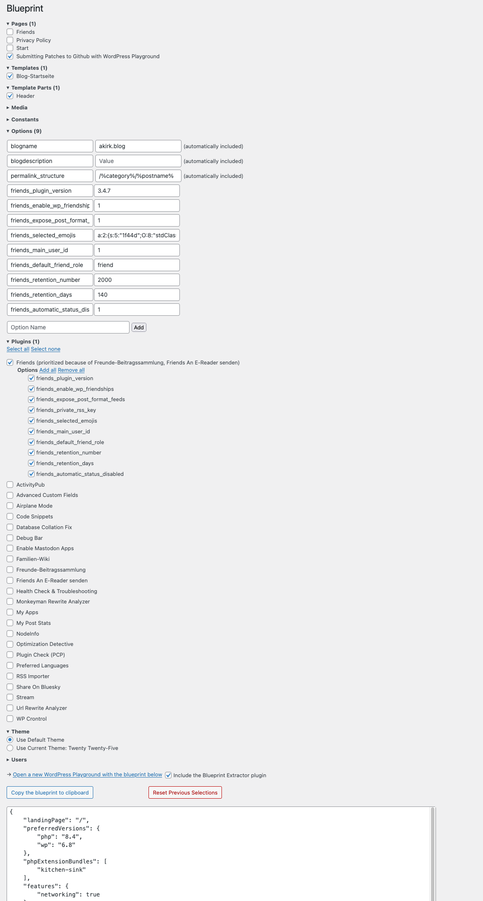

# Blueprint Extractor

This plugin assists you in creating a WordPress Playground Blueprint for the current site. It provide a wp-admin page that allows selecting a subselection of important entities of the current site:



[Try it in WordPress Playground](https://playground.wordpress.net/#{%22steps%22:[{%22step%22:%22installPlugin%22,%22pluginData%22:{%22resource%22:%22url%22,%22url%22:%22https://github-proxy.com/proxy/?repo=akirk/blueprint-extractor&branch=main%22},%22options%22:{%22activate%22:true}}]}) or [build on it via the Step Library](https://akirk.github.io/playground-step-library/#eyJzdGVwcyI6W3sic3RlcCI6ImJsdWVwcmludFJlY29yZGVyIn1dfQ==)

## Development

Use the Playground CLI to run the plugin in your local environment.

```bash
npx @wp-playground/cli@latest server --mount=.:/wordpress/wp-content/plugins/blueprint-extractor --login --blueprint=blueprint.json
```

Open the [Playground URL in your browser to see the plugin admin page.](http://127.0.0.1:9400/wp-admin/admin.php?page=blueprint)